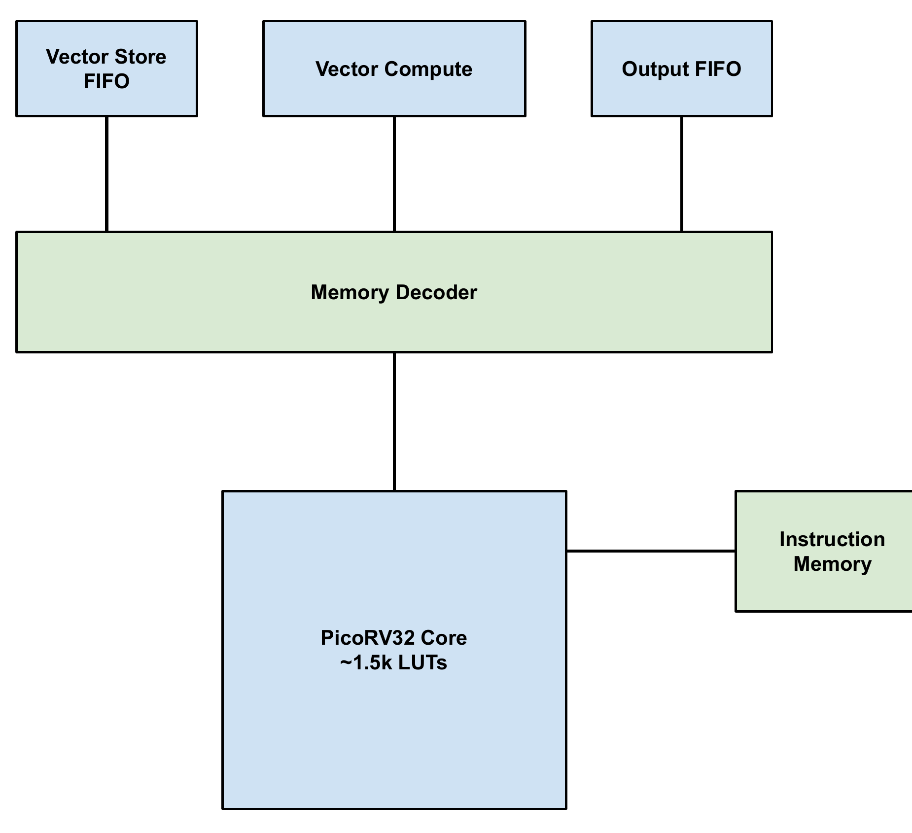

# RISC-V Dot-Product SoC for the Efinix Ti180

A small system-on-chip where an open source **PicoRV32** RISC-V core drives a **4-lane int16
dot-product accelerator** over a simple memory-mapped bus. Written in SystemVerilog, verified in
Verilator with a C++ testbench per module and a firmware-driven system test. The target is the
Efinix Titanium Ti180 J484 development kit; this phase stops at simulation.

<p align="center">
  
</p>

<p align="center"><sub>Original whiteboard with design notes: <a href="Documentation/diagramAlpaca.pdf">Documentation/diagramAlpaca.pdf</a></sub></p>

## What it does

The firmware generates two 64-element vectors of 16-bit signed integers with a seeded xorshift
generator, writes them into two scratchpad memories, and starts the accelerator. The accelerator
reads four element pairs per clock from the scratchpads on private ports, multiplies them in four
DSP-friendly lanes, sums the products, and accumulates into a 48-bit result, finishing a full dot
product in 16 cycles. Each result is pushed into a 16-deep pop-on-read FIFO. The firmware computes
the same dot product in software, drains the FIFO, compares, and raises pass or fail on a GPIO
register. The system test watches that register and independently recomputes every result.

```
result = a0*b0 + a1*b1 + ... + a63*b63        a_i, b_i : int16    result : 48-bit signed
```

The core never touches the vector arithmetic. It is a control plane; the accelerator is the data
plane.

## Architecture at a glance

| Block | File | Role |
|---|---|---|
| PicoRV32 | `rtl/vendor/picorv32.v` | RV32IM control core, unmodified, native memory port |
| Bus decoder | `rtl/bus_decoder.sv` | Routes each core transaction to one peripheral by address bits [19:16] |
| Instruction / data RAM | `rtl/ram32.sv` | 16 KB program (preloaded from `firmware.hex`) and 8 KB stack and data |
| Scratchpads A and B | `rtl/scratchpad.sv` | 64 x int16 each; byte-addressable to the core, 64-bit rows to the accelerator |
| MAC lane x4 | `rtl/mac_lane.sv` | Registered signed 16 x 16 multiply, one DSP block each on the FPGA |
| Adder tree | `rtl/adder_tree.sv` | Sums the four products |
| Dot-product controller | `rtl/dotp_ctrl.sv` | FSM, CTRL/STATUS/LENGTH/RESULT registers, 48-bit accumulator |
| Result FIFO | `rtl/result_fifo.sv` | 16 x 48 bits, reading the high word pops |
| GPIO | `rtl/gpio.sv` | Heartbeat, pass, fail, finished bits |
| Top level | `rtl/soc_top.sv` | Wires it all; ports are clock, reset, GPIO, trap, and a debug mirror of FIFO pushes |

Every peripheral speaks the same handshake: a transaction is accepted on the cycle
`bus_sel && !bus_ready`, side effects happen on that edge, and `bus_ready` pulses for one cycle.
One bus master, one transaction in flight, no arbitration.

### Memory map

| Base | Block | Registers |
|---|---|---|
| `0x0000_0000` | Instruction RAM | 16 KB |
| `0x0001_0000` | Data RAM | 8 KB |
| `0x0002_0000` | Scratchpad A | `int16_t[64]` |
| `0x0003_0000` | Scratchpad B | `int16_t[64]` |
| `0x0004_0000` | Dot-product control | `CTRL` 0x00, `STATUS` 0x04, `LENGTH` 0x08, `RESULT_LO` 0x0C, `RESULT_HI` 0x10 |
| `0x0005_0000` | Result FIFO | `COUNT` 0x00, `LO` 0x04, `HI` 0x08 (pops) |
| `0x0006_0000` | GPIO | `OUT` 0x00: bit 0 heartbeat, 1 pass, 2 fail, 3 finished |

All sizes and addresses live in exactly two places that must agree: `rtl/soc_pkg.sv` for the
hardware and `firmware/memmap.h` for the software.

## Repository layout

```
rtl/            SystemVerilog modules, one per file; soc_pkg.sv holds every parameter
rtl/vendor/     PicoRV32 (verbatim) and its Verilator lint config
tb/             C++ Verilator testbenches, one per module; tb/common/ has the harness and golden models
firmware/       Bare-metal C, startup stub, linker script, Makefile producing firmware.hex
docs/           systemSpec.md (plain-English design), research notes, plans, this diagram
agentProjectDocs/  Architecture, standards, decisions log, progress tracker
Documentation/  Efinix datasheets and dev-kit guides, PicoRV32 source archive, whiteboard PDF
```

## Getting started (macOS)

```
brew install verilator riscv64-elf-gcc surfer
make test                              # build firmware, run every testbench with two seeds
```

Other targets:

```
make test-dotp_ctrl                    # one module
make test-dotp_ctrl ARGS="--seed 7 --iters 500"
make test-<module> ARGS="--no-trace"   # skip the waveform dump
make lint                              # Verilator -Wall (project policy waivers in the Makefile)
make waves TEST=soc_top                # open sim/tb_soc_top.fst in Surfer
make firmware                          # just build firmware/firmware.hex
make clean
```

Efinity, the Efinix synthesis and programming tool, runs only on Linux or Windows; nothing in
this phase needs it. The RTL uses no vendor primitives so it can be synthesised unchanged later.

## Verification

Each module has a testbench with a C++ golden model and command-line seed: the multiplier against
a plain multiply, the adder tree against a sum, the accelerator against a behavioural dot product
for every LENGTH from 0 to 64 with poisoned elements past the end, the FIFO against a software
queue including full and overflow, the decoder against an address table, the RAMs and scratchpads
against byte-strobed memory models.

`tb_soc_top` loads the compiled firmware, runs until the firmware raises the finished bit, and
checks: pass set, fail clear, sixteen heartbeat toggles, no CPU trap, and all sixteen hardware
results equal to an independent C++ recomputation from the same seed. The whole suite plus lint
runs from a clean checkout with `make test && make lint`.

## Performance note

A full firmware run is about 245k cycles for 16 iterations, roughly 15k per iteration. That time
is almost entirely the core: around five cycles per instruction on this two-cycle bus, plus the
shift-add multiplier it uses for the software reference. The accelerator needs about 20 cycles
per dot product. The cheapest lever is `ENABLE_FAST_MUL=1` on the PicoRV32 instantiation; see
`agentProjectDocs/decisions.md` for why it is off, and
`docs/research/2026-09-18-improvement-ideas.md` for a ranked list of what to do next.

## Documents

- `docs/systemSpec.md`: the design in plain English, block by block.
- `docs/research/2026-09-18-architecture-research.md`: hardware findings and the reasoning behind every decision.
- `agentProjectDocs/architecture.md`: exact register bits, invariants, and the module list.
- `agentProjectDocs/decisions.md`: append-only log of every technical choice and the alternatives rejected.
- `agentProjectDocs/progress-tracker.md`: current phase, deferred review items, and what comes next (board bring-up).
